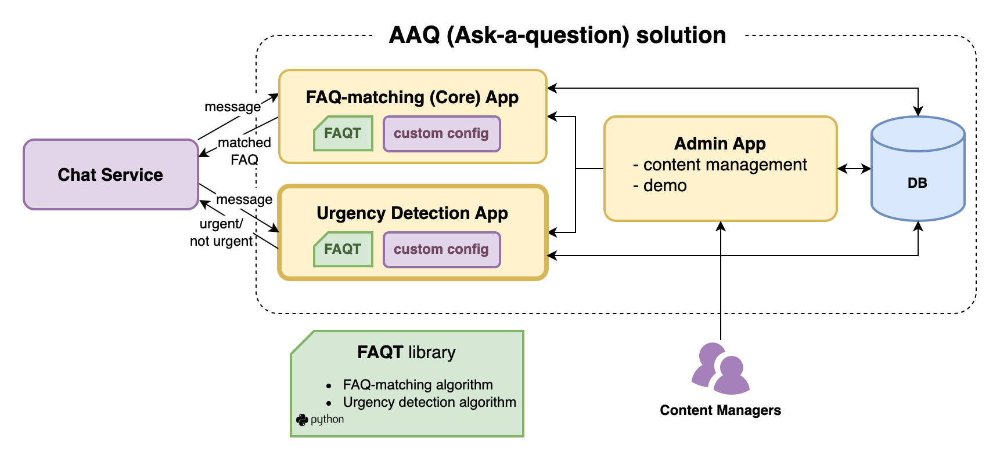

[](https://coveralls.io/github/IDinsight/aaq_ud_template)


# Ask a Question (AAQ) Urgency Detection (UD) Template Repository

To start development on a new AAQ UD solution, clone or fork this and follow the setup instructions below.

Ensure to pull in new features from this repository regularly.

## What is this?

This template provides a ready-to-use solution for application for detecting urgency in messages that can
be used by an existing chat service. It uses the urgency detection tools from the 
[FAQT](https://github.com/IDinsight/faqt) library.

This application receives inbound messages in json, runs it through a pre-defined
urgency detection model, and returns the urgency scores (or binary labels) as a response.




## Setup

### Copy this code

Clone or fork this repository.

If you clone this, please set up a new repository for future commits and add this repository as another remote called `template`. This will allow you to pull in new changes made to this template. Here are the instructions on how to do this:

1. Clone this repo

    ```
    git clone git@github.com:IDinsight/aaq_ud_template.git <project_name>
    ```

2. Switch to <project_name> folder and change remote name to `template`

    ```
    git remote rename origin template
    ```

3. Create a new repository in Github
4. Add it as remote for local repo

    ```
    git remote add origin git@github.com:<username>/<project_name>.git
    ```

5. Set local to track that remote

    ```
    git push -u origin main
    ```

6. You may also wish to [set your environment variables](https://docs.conda.io/projects/conda/en/latest/user-guide/tasks/manage-environments.html#setting-environment-variables) for the conda environment. This will allow you to run and test locally. Here are the variables you should set

    ```
    export PG_ENDPOINT=
    export PG_PORT=
    export PG_DATABASE=
    export PG_USERNAME=
    export PG_PASSWORD=

    export UD_INBOUND_CHECK_TOKEN=
    export TOKEN_MACHINE_USER=
    export PROMETHEUS_MULTIPROC_DIR=
    ```

    See `docs/deployment_instructions.md` for more detailed explanations of each secret environment variable.
### Configure project details

The `project_config.cfg` in the root directory should be updated with your project details.

### Initialise

#### Run `make setup-dev`

This command does the following:

1. Creates a `conda` virtual environment
2. Installs dependencies from `requirements.txt` and `requirements_dev.txt`
3. Installs pre-commit hooks
4. Creates secrets files in `./secrets/`

#### Set up infrastructure using terraform

The terraform script to set up the infrastructure for a single AAQ solution (which may or may
not include Urgency Detection app) is currently defined in the
[aaq_core_template](https://github.com/IDinsight/aaq_core_template) repository. Follow the
instructions in aaq_core_template's [`infrastructure/README.md`](https://github.com/IDinsight/aaq_core_template/tree/main/infrastructure).


#### Enter details in secrets file
By running `make setup-dev`, all necessary secrets files with empty secrets will have
been created under `./secrets`.

Edit each of the files in `./secrets` and set the correct parameters.

Note the DB connection details and DB secrets as instructed by [`infrastructure/README.md`](https://github.com/IDinsight/aaq_core_template/tree/main/infrastructure), and save them in the following files:

- Save the dev DB details in `secrets/database_secrets.env`

- Save the test DB details in `tests/config.yaml`. This file is used by `pytest` and is required to run tests locally.

- Save the test DB details `performance_validation/config.yaml`. This is used for performance validation of 
the UD model.

- Other files should be updated before you can test the instance.

See `docs/deployment_instructions.md` for more detailed explanations of each secret
environment variable.

#### Run `make setup-ecr`

This creates the ECR repository for the project to store docker images. This step is not
necessary if you have done this already in another AAQ app (e.g. core).

### Configure to context

1. Update the files under `core_model/app/contextualization/`
2. Update `core_model/app/config/parameters.yml`

## Other tasks

1. Setup `coveralls`
2. Setup auto deployment on EC2 (using webhooks or other)
3. Update this file!
    - Remove irrelevant content (all the template text)
    - Update the badges at the top of this file

4. Setup application monitoring
5. Setup other apps as necessary

## Running the project

**Note: Ensure you have updated all the secrets in the files under `/secrets/`.**

To run this project:

1. `make image` to create the docker image
2. `make container` to create the docker container

To run monitoring,
1. `make prometheus` to run prometheus server on docker
2. `make grafana` to run grafana server on docker (go to localhost:3000 and login with admin/admin)
3. `make uptime-exporter` to relay endpoint uptime information to prometheus


## Setting up secrets for Github Actions
Github actions scripts in the `.github` folder requires the same or similar secrets as
in the `secrets` folder.

By default we assume the secrets are stored in AWS Secrets
Manager and are dynamically loaded during Github Actions.

However, you must set your AWS credentials as Github Actions secrets:
```bash
AWS_ACCESS_KEY_ID
AWS_REGION
AWS_SECRET_ACCESS_KEY
```

To use AWS Secrets Manager, make sure that you have the following secrets stored on AWS.
(If you would like to use Github Actions secrets instead, you will need to set the same
secrets on Github and modify the Github Actions scripts yourself.)

1. Urgency detection secrets
    ```bash
    # From `secrets/app_secrets.env`
    UD_INBOUND_CHECK_TOKEN  
    ENABLE_RULE_REFRESH_CRON

    # If using validation
    VALIDATION_BUCKET  # S3 bucket storing validation data
    ```
    Unlike in the Core app, the validation data prefixes are set in `performance_validation/config.yaml`

2. Global secrets (to be used also by the core and admin apps)
    ```bash
    # From `secrets/databse_secrets.env`
    PG_ENDPOINT
    PG_PASSWORD
    PG_PORT
    PG_USERNAME
    PG_DATABASE

    # From `secrets/sentry_config.env`
    SENTRY_DSN
    SENTRY_ENVIRONMENT
    SENTRY_TRACES_SAMPLE_RATE
    ```

3. Staging DB secrets -- this should be automatically created under the secret named `<PROJECT_SHORT_NAME>-db` if you used terraform.
    ```bash
    db_endpoint
    db_password
    db_username
    ```

4. Github machine user token secret
    ```bash
    TOKEN_MACHINE_USER
    ```

Make sure to modify the secrets ARNs in `.github/validation-test.yml` and
`.github/docker-build-push.yml` to your own ARNs.

## Thank you

This has been built for and in collaboration with Praekelt. We are grateful to
Praekelt for the opportunity to use data science to contribute to their mission.
