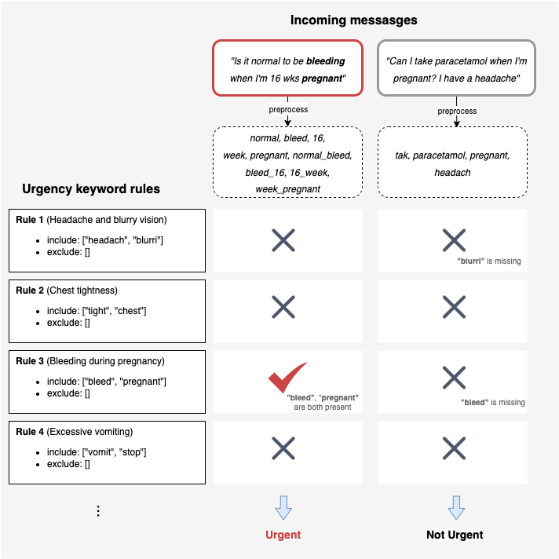

](https://coveralls.io/github/IDinsight/[your-project])


# Ask a Question (AAQ) Urgency Detection (UD) Template Repository

This is the readme for the AAQ UD Template repository. To start development on a new AAQ UD solution, clone or fork this and follow the setup instructions below.

Ensure to pull in new features from this repository regularly.

## What is this?

This module is the urgency detection app that receives inbound messages and checks if they are urgent based on the urgency rules.



## Setup

### Copy this code

Clone or fork this repository.

If you clone this, please set up a new repository for future commits and add this repository as another remote called `template`. This will allow you to pull in new changes made to this template. Here are the instructions on how to do this:

1. Clone this repo

```
git clone git@github.com:IDinsight/aaq_ud_template.git <project_name>
```

2. Switch to <project_name> folder and change remote name to `template`

```
git remote rename origin template
```

3. Create a new repository in Github
4. Add it as remote for local repo

```
git remote add origin git@github.com:IDinsight/<project_name>.git
```

5. Set local to track that remote

```
git push -u origin main
```

6. You may also wish to [set your environment variables](https://docs.conda.io/projects/conda/en/latest/user-guide/tasks/manage-environments.html#setting-environment-variables) for the conda environment. This will allow you to run and test locally. Here are the variables you should set

```
export PG_ENDPOINT=
export PG_PORT=
export PG_DATABASE=
export PG_USERNAME=
export PG_PASSWORD=

export UD_INBOUND_CHECK_TOKEN=
export TOKEN_MACHINE_USER=
```

### Configure project details

The `project_config.cfg` in the root directory should be updated with your project details.

### Initialise

#### Run `make setup-dev`

This command does the following:

1. Creates a `conda` virtual environment
2. Installs dependencies from `requirements.txt` and `requirements_dev.txt`
3. Installs pre-commit hooks
4. Creates secrets files in `./secrets/`

#### Enter details in secrets file

You should edit each of the files in `./secrets` and set the correct parameters.

-   `database_secrets.env` is the most important one to complete right now as these details will be used to create tables in the next step. You can set whatever username (usually `flask`) and password you prefer. These details will be used to create the role.
-   `tests/config.yaml` should also be updated. This file is used by `pytest` and is required to run tests.
-   Other files should be updated before you can test the instance.

See `docs/deployment_instructions.md` for more detailed explanations on each secret environment variable.

#### Run `make setup-db-all`

This command does the following:

1. Creates the dev and test user
2. Creates the dev and test databases
3. Creates a new schema (based on `$PROJECT_SHORT_NAME`) and sets as default
4. Creates the tables needed for the app

#### Run `make setup-ecr`

This creates the ECR repository for the project to store docker images.

#### Setup Github secrets

Note the secrets setup for this repository in Github. Ensure that these are also created in your repo.

### Configure to context

1. Update the files under `core_model/app/contextualization/`
2. Update `core_model/app/config/parameters.yml`

## Other tasks

1. Setup `coveralls`
2. Setup auto deployment on EC2 (using webhooks or other)
3. Update this file!

    - Remove irrelevant content (all the template text)
    - Update the badges at the top of this file

4. Setup application monitoring
5. Setup other apps as necessary

## Running Project

**Note: Ensure you have updated all the secrets in the files under `/secrets/`.**

To run this project:

1. `make image` to create the docker image
2. `make container` to create the docker container
