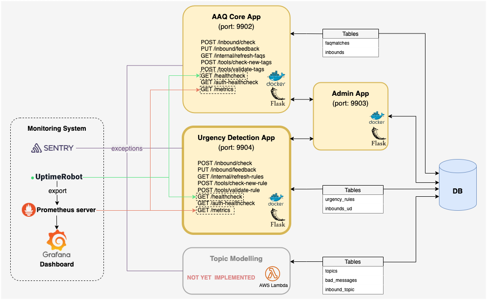

June 13, 2022

CURRENT VERSION: aaq_ud_template:v1.0.0

# Deploying the AAQ Urgency Detection App (Template)

This is the deployment instructions for the **Urgency Detection App**. It does not cover deployment for the other 3 apps shown below.

# Initial setup

Setup DB tables using `scripts/ud_tables.sql`.

# Images

The Docker image for the urgency detection model server is hosted on AWS ECR at
`[AWS_ACCOUNT_ID].dks.ecr.af-south-1.amazonaws.com/aaq_solution/aaq_ud_template:v1.0.0`

Your AWS user will need access to this resource. Please contact IDinsight for access.

## Resources for images

The urgency detection model does not need many resources.

## Image setup

* The inbound port mapping is 9904:9904 (TCP).
* Mount a folder that is cleared at startup to the following target `/tmp` to collect Prometheus metrics

### Environment variables
The following environment variables are required when running the container:
- `UD_INBOUND_CHECK_TOKEN`: Bearer token. Requests to `/inbound/check` and `/auth-healthcheck` must be authenticated with this bearer token in the header.
  - Can be anything you want, recommended alphanumeric.
- Postgres
  - `PG_ENDPOINT`: Postgres instance endpoint
  - `PG_PORT`: Postgres port
  - `PG_DATABASE`: Database name
  - `PG_USERNAME`
  - `PG_PASSWORD`
- Sentry
  - `SENTRY_DSN`
  - `SENTRY_ENVIRONMENT`
  - `SENTRY_TRANSACTIONS_SAMPLE_RATE`
- `DEPLOYMENT_ENV`
    - For production, this should be set to `DEPLOYMENT_ENV=PRODUCTION`, which disables the tag check and tag validation endpoints for stability.
    - Note that the admin app (based on `aaq_admin_template`) depends on `aaq_ud_template` endpoints that are disabled if `DEPLOYMENT_ENV=PRODUCTION`. Thus, the admin app should always be a non-production instance of the urgency detection app.
- `ENABLE_RULE_REFRESH_CRON`: Only set to "true" if you'd like to run a cron job within the containers to periodically refresh urgency rules.
- `PROMETHEUS_MULTIPROC_DIR`: Directory to save prometheus metrics collected by multiple processes. It should be a directory that is cleared regularly (e.g. `/tmp`)

### Jobs

* Setup job in kubernetes to call `/internal/refresh-rules` every day. (You may want to set `ENABLE_FAQ_REFRESH_CRON=false`.)

# Monitoring
You can configure your existing Prometheus server, UptimeRobot, and Grafana as follows to monitor the urgency detection app. See the diagram at the top to see how the different components interact with each other.

## Prometheus Server
Scrape metrics from `GET /metrics`.

## UptimeRobot
Add monitors to watch the `/healthcheck` endpoint.

## Grafana
Grafana configs are providided in `monitoring/grafana`.

Define new data sources in `monitoring/grafana/datasource.yaml`. If you already have Grafana connected to Prometheus, you may not need to do this step.

Add providers, defined under `monitoring/grafana/dashboard.yaml`.

The dashboard for Urgency Detection is defined in `monitoring/grafana/dashboard/mc_ud_dashboard.json`. You can add it to your existing Grafana instance.
